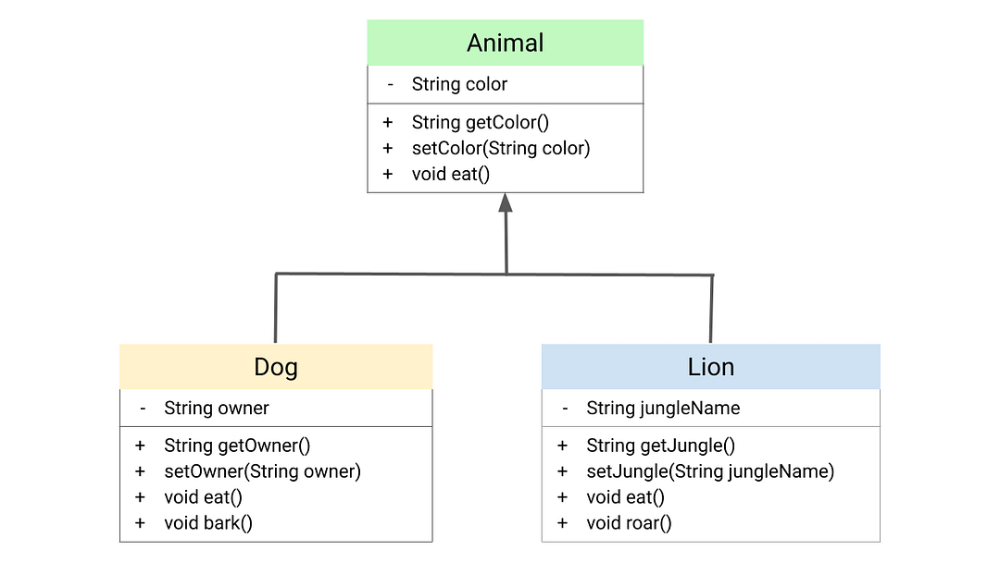

# Task 1
## who invent OOP and why
Alan Kay coined the term “object oriented programming” at grad school in 1966 or 1967. The big idea was to use encapsulated mini-computers in software which communicated via message passing rather than direct data sharing — to stop breaking down programs into separate “data structures” and “procedures”.

## Encapsulation & Abstraction
Abstraction and Encapsulation are two of the fundamental concepts in OOP. 
- Encapsultion is the concept of binding data and methods and preventing it from unauthorized access. It wraps up data and functions under a single unit. Another way to think about encapsulation is, that it is a protective shield that prevents the data from being accessed by the code outside this shield.

- Data Abstraction is the property by virtue of which only the essential details are displayed to the user. The trivial or the non-essential units are not displayed to the user. Ex: A car is viewed as a car rather than its individual components. Data Abstraction may also be defined as the process of identifying only the required characteristics of an object ignoring the irrelevant details. The properties and behaviors of an object differentiate it from other objects of similar type and also help in classifying/grouping the objects. 

## Inheritance
When a class derives from another class. The child class will inherit all the public and protected properties and methods from the parent class. In addition, it can have its own properties and methods. An inherited class is defined by using the extends keyword.


## PHP Interfaces & Polymorphism
Interfaces allow you to specify what methods a class should implement.
Interfaces make it easy to use a variety of different classes in the same way. When one or more classes use the same interface, it is referred to as "polymorphism".
Example :

```
<?php
interface InterfaceName {
  public function someMethod1();
  public function someMethod2($name, $color);
  public function someMethod3() : string;
}
?>
```
Polymorphism in PHP is implemented using the interface pattern. Think about interface as the skeleton or blueprint for your class which implements it. The above code has an interface named shapesInterface. An interface can define method names and arguments, but not the contents of the methods.
PHP uses dynamic binding to determine which method implementation to execute at runtime based on the object type. When a method is called on an object, PHP resolves the method implementation based on the object's actual class type.

## PHP Traits
Traits are used to declare methods that can be used in multiple classes. Traits can have methods and abstract methods that can be used in multiple classes, and the methods can have any access modifier (public, private, or protected).

Traits are declared with the trait keyword:
```
<?php
trait TraitName {
  // some code...
}
?>
```
To use a trait in a class, use the use keyword:
```
<?php
class MyClass {
  use TraitName;
}
?>
```

# Resources
- [Geeks for Geeks](https://www.geeksforgeeks.org/difference-between-abstraction-and-encapsulation-in-java-with-examples/)
- [W3Schools](https://www.w3schools.com/php/php_oop_interfaces.asp)